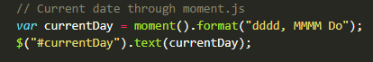
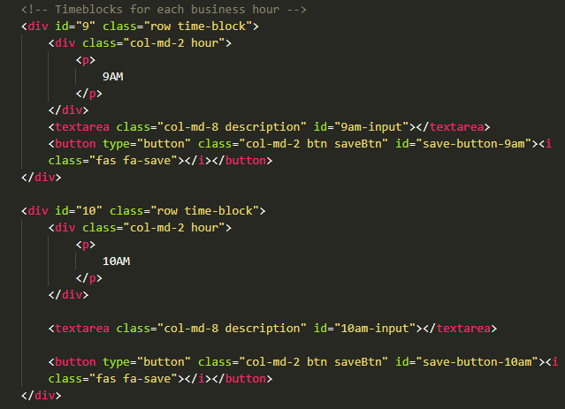
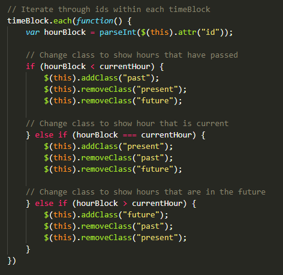
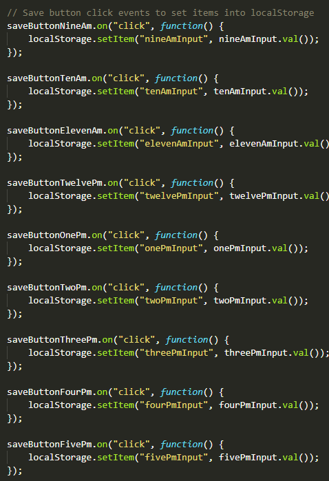
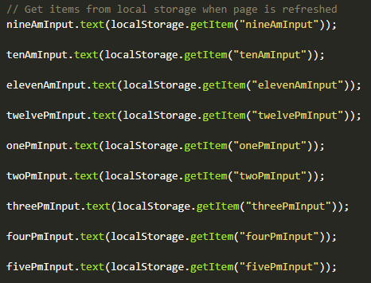

# Work-day-scheduler

## About the project

This project required the creation of a work day scheduler. It included starter HTML and CSS code. A script file needed to be created using jQuery instead of JavaScript.

> The final project can be found at: https://chardige.github.io/Work-day-scheduler/

> The final HTML, CSS and Script can be found at: https://github.com/CharDige/Work-day-scheduler

## User story

```
AS AN employee with a busy schedule
I WANT to add important events to a daily planner
SO THAT I can manage my time effectively
```

## Acceptance criteria

```
GIVEN I am using a daily planner to create a schedule
WHEN I open the planner
THEN the current day is displayed at the top of the calendar
WHEN I scroll down
THEN I am presented with timeblocks for standard business hours
WHEN I view the timeblocks for that day
THEN each timeblock is colour coded to indicate whether it is in the past, present, or future
WHEN I click into a timeblock
THEN I can enter an event
WHEN I click the save button for that timeblock
THEN the text for that event is saved in local storage
WHEN I refresh the page
THEN the saved events persist
```

It was required to use a date utility library to work with date and time. For this project, [Moment.js](https://momentjs.com/) was used.

## Technologies used

- [Bootstrap](https://getbootstrap.com/docs/4.6/getting-started/introduction/)
- [Font Awesome Icons](https://fontawesome.com/icons)
- [Google Fonts](https://fonts.google.com/)
- [Moment.js](https://momentjs.com/)
- [jQuery](https://jquery.com/)
- HTML
- CSS

## The process -- how I approached this project

This project required the use of a lot of previous knowledge of how JavaScript works, and then transforming it to be written as jQuery.

I mapped out my process by breaking up the project into small steps. For this, I used the acceptance criteria:

1. Added the moment.js code into the script to display the current date near the top of the page.



2. Created `div` elements for the timeblocks, then changed some `div` elements to `textarea` and `button` elements. Initially, I had the `textarea` within a `div`, and then pulled on `Bootstrap` classes for the `textarea`, not realising this was unnecessary due to the styling in the CSS file. Once I realised this, I removed the `div` and class.



3. Added jQuery functions to test the save button functionality. I would later update this for each save button so that it would save each input into local storage.

4. Used moment.js to set a variable for the current hour, which would be used within an `each` function to compare the `id` within the `div` with the class `time-block` with the current hour. This would then be used in a conditional statement, which if the `id` (or `hourBlock`) was less than, equal to or greater than the `currentHour`, then the colour would change to show it was 'past', 'present' or 'future'.



5. Updated the jQuery variables and 'click' events to be linked to each individual save button, so that when a save button was clicked, an `input.value` would be saved to local storage.



6. Added in jQuery elements to add text to each `textarea` element by getting the items out of the local storage.



7. I then updated the CSS to make some personalisation changes, such as changing the background colour to green and the hover pseudo-element to green as well.

## Final


> The final project can be found at: https://chardige.github.io/Work-day-scheduler/

> The final HTML, CSS and Script can be found at: https://github.com/CharDige/Work-day-scheduler

## Challenges and what I learnt

My greatest challenge for this assignment was getting the colours to change depending on the hour of the day. I had tried using moment.js elements, such as `.isSame`, but this gave me errors as this would only work if a set date was included. I didn't know this before, so this was a learning curve for me. 

Once I'd moved past that and set up my `hourBlock` and `currentHour` variables, I developed my conditional statement. I had originally set my conditional statements to add or remove classes to `timeBlock`, which were not working. This problem was solved by replacing `timeblock` to `$(this)`, as it pointed to each individual section, not all of them.

I didn't realise that every `this` required to be written as `$(this)`. When I had tried the `this` solution previously, it gave an error, which confused me. By reaching out for assistance, I was provided guidance on how to properly refer to `this` in jQuery. This then fixed the issue and taught me a valuable lesson.

## Credits

I referred to a few websites throughout this assignment. I have provided references to these pages below:

Mozilla Contributors (2022), *parseInt()*, mdn web docs, https://developer.mozilla.org/en-US/docs/Web/JavaScript/Reference/Global_Objects/parseInt

W3 Schools (2022), *JavaScript parseInt()*, W3 Schools, https://www.w3schools.com/jsref/jsref_parseint.asp

MkDocs (2022), *hour*, momentjs.com, https://momentjscom.readthedocs.io/en/latest/moment/02-get-set/04-hour/

Rico Cruz (2022), *Moment.js cheatsheet*, DEVHINTS.IO, https://devhints.io/moment

OpenJS Foundation and jQuery Contributors (2022), *.attr()*, jQuery API Documentation, https://api.jquery.com/attr/

OpenJS Foundation and jQuery Contributors (2022), *addClass()*, jQuery API Documentation, https://api.jquery.com/addclass/

OpenJS Foundation and jQuery Contributors (2022), *each()*, jQuery API Documentation, https://api.jquery.com/each/

W3 Schools (2022), *jQuery removeClass() Method*, W3 Schools, https://www.w3schools.com/jquery/html_removeclass.asp

## License

[MIT License Copyright (C) 2022 Charlotte Dige](./LICENSE)